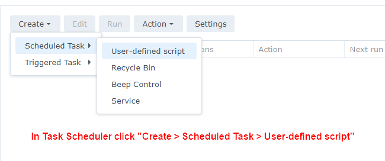
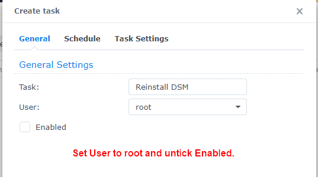
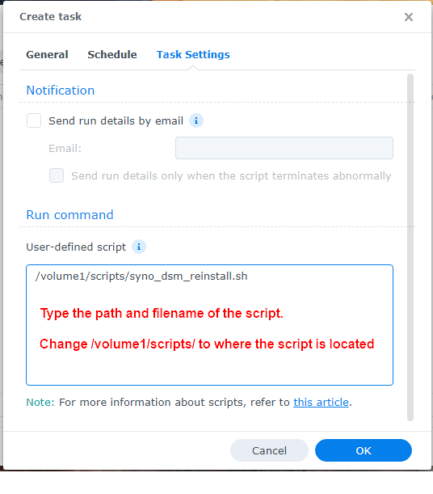
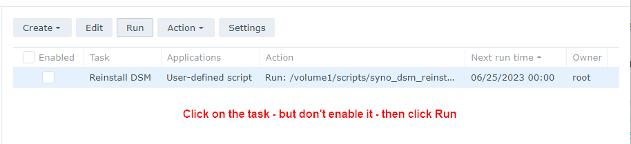

# Как запустить сценарий в планировщике задач Synology

Чтобы запустить сценарий из планировщика задач, выполните следующие действия:

**Примечание** Вы можете настроить задачу расписания и оставить ее отключенной, чтобы она запускалась только тогда, когда вы выбираете задачу в планировщике задач и нажимаете кнопку «Выполнить».

1.Перейдите в «Панель управления» > «Планировщик заданий» > нажмите «Создать» > и выберите «Запланированное задание» .
2. Выберите Пользовательский сценарий .
3. Введите имя задачи.
4. Выберите root в качестве пользователя (сценарий должен запускаться от имени root).
5. Снимите флажок « Включить» , чтобы он не запускался по расписанию.
6. Нажмите «Настройки задачи» .
7. В поле Пользовательский скрипт введите путь к скрипту
    - например, если вы сохранили сценарий в общей папке на томе 1 под названием «scripts», введите: /volume1/scripts/syno_dsm_reinstall.sh
8. Нажмите ОК, чтобы сохранить настройки.
9. Нажмите на задачу, но не включайте ее, затем нажмите «Выполнить» .
10. После запуска сценария вы можете удалить задачу или сохранить ее на случай, если она понадобится снова.

**Вот несколько скриншотов, показывающих, что нужно настроить::**

Шаг 1

Шаг 2

Шаг 3

Шаг 4

