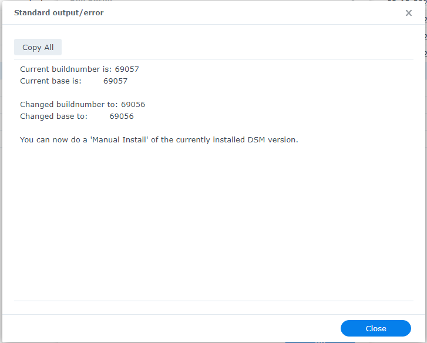

# Как просмотреть выходные данные сценария, запущенного в Synology Планировщика задач

После<a href=how_to_run_from_scheduler.md/>для просмотра результатов выполнения сценария выполните следующие действия:

1. Перейдите в Панель управления > Планировщик задач .
2. Выберите запланированную задачу.
3. Нажмите «Действие» , затем «Просмотреть результат» .
4. В разделе «Стандартный вывод/ошибка» нажмите ссылку «Просмотреть подробности» .

Затем вы должны увидеть вывод скрипта:

